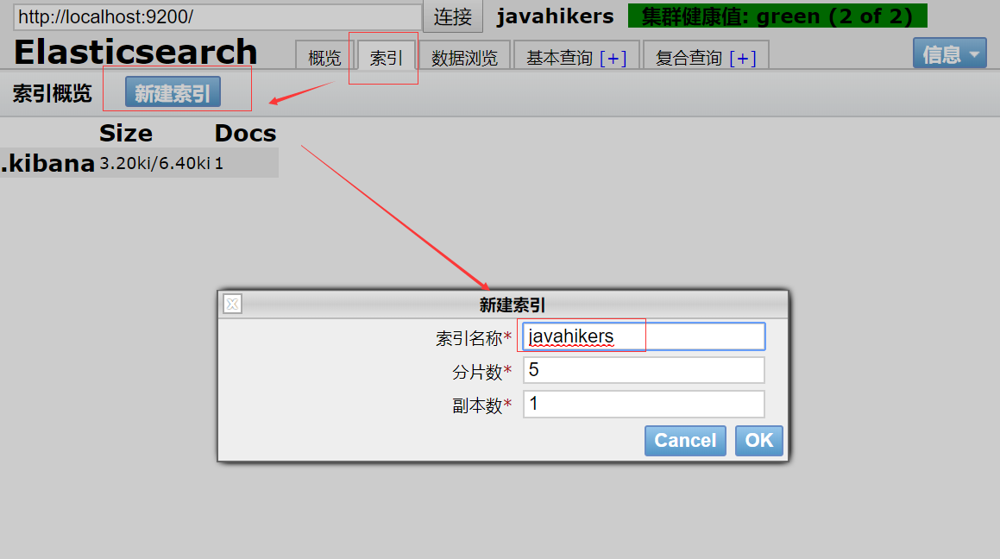
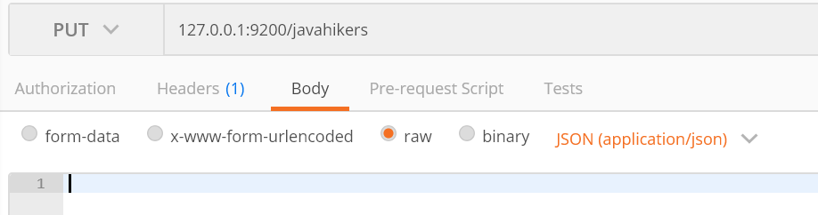
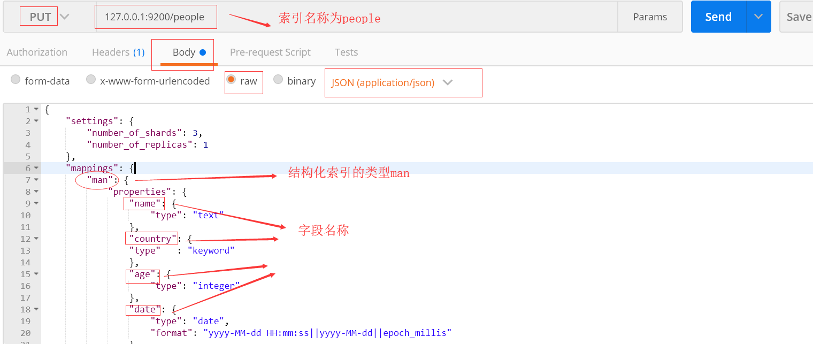
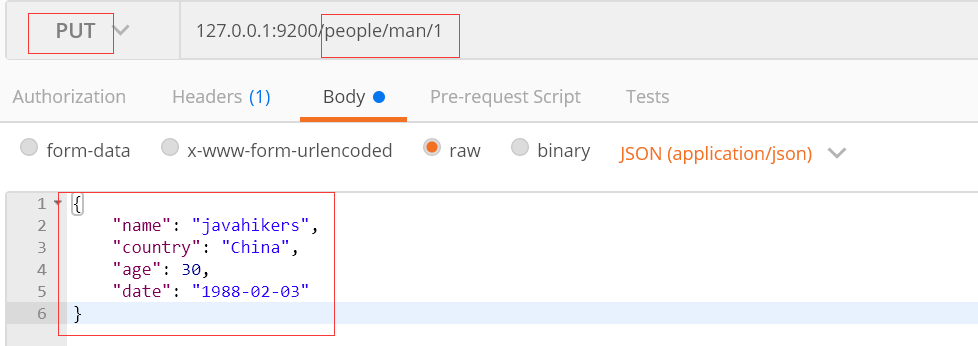
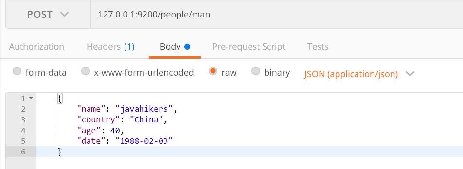
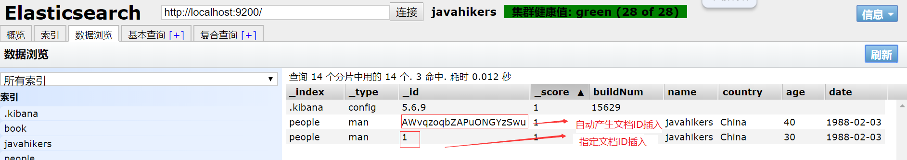

# RESTFul API
API基本格式 http://ip:port/索引/类型/文档ID
常用http动词， GET PUT POST DELETE

# 创建索引
## 非结构化创建
通过Elasticsearch-head创建索引

也可以通过postman工具发送put请求，创建索引，127.0.0.1:9200/javahikers
后面都将使用这种方式来操作

## 结构化创建

    通过postman发送put请求，127.0.0.1:9200/people
    {
        "settings": {
            "number_of_shards": 3,
            "number_of_replicas": 1
        },
        "mappings": {
            "man": {
                "properties": {
                    "name": {
                        "type": "text"
                    },
                    "country": {
                        "type": "keyword"
                    },
                    "age": {
                        "type": "integer"
                    },
                    "date": {
                        "type": "date",
                        "format": "yyyy-MM-dd HH:mm:ss||yyyy-MM-dd||epoch_millis"
                    }
                }
            },
            "woman": {
                
            }
        }
    }

# 插入文档
## 指定文档ID插入

    通过postman发送put或post请求，127.0.0.1:9200/people/man/1
    {
        "name": "javahikers",
        "country": "China",
        "age": 30,
        "date": "1988-02-03"
    }

## 自动产生文档ID插入

    通过postman发送post请求，127.0.0.1:9200/people/man。put请求无法自动产生文档ID。
    {
        "name": "javahikers",
        "country": "China",
        "age": 40,
        "date": "1988-02-03"
    }

对比指定文档ID插入和自动产生文档ID插入的结果

# 修改文档
## 直接修改文档

    post请求127.0.0.1:9200/people/man/1/_update
    {
        "doc": {
            "age": 30
        }
    }

## 脚本修改文档

    post请求127.0.0.1:9200/people/man/1/_update
    {
        "script": {
            "lang": "painless",
            "inline": "ctx._source.age += 10"
        }
    }

    将参数放在外面, post请求127.0.0.1:9200/people/man/1/_update
    {
        "script": {
            "lang": "painless",
            "inline": "ctx._source.age = params.age",
            "params": {
                "age": 100
            }
        }
    }

# 删除操作
## 删除索引
    delete请求127.0.0.1:9200/people
## 删除文档
    delete请求127.0.0.1:9200/people/man/1

# 总结
|场景|请求类型|
|:--|:--|
|创建索引|put|
|指定文档ID插入|put/post|
|自动产生文档ID插入|post|
|直接修改文档|post|
|脚本修改文档|post|
|删除索引|delete|
|删除文档|delete|
