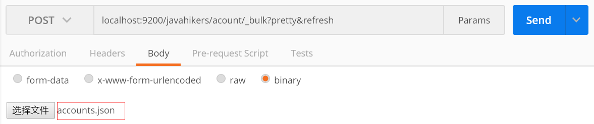

# 建索引
## logstash建索引
+ 去[json数据生成网站](https://www.json-generator.com)生成的json格式的数据
生成的数据不能直接使用，需要手动加工一下，我已经加工好了，可以点击[下载数据](/download/generated.rar)
+ 通过logstash导入json数据到Elasticsearch，参考我的博文[Elasticsearch5.6.9-logstash读取json格式文件数据导入到Elasticsearch](http://javahikers.github.io/2019/07/14/Elasticsearch5.6.9-logstash%E8%AF%BB%E5%8F%96json%E6%A0%BC%E5%BC%8F%E6%96%87%E4%BB%B6%E6%95%B0%E6%8D%AE%E5%AF%BC%E5%85%A5%E5%88%B0Elasticsearch/)

## 使用_bulk api 建立索引
+ 去官网下载数据[accounts.json](https://raw.githubusercontent.com/elastic/elasticsearch/master/docs/src/test/resources/accounts.json)
        curl -O https://raw.githubusercontent.com/elastic/elasticsearch/master/docs/src/test/resources/accounts.json
+ 命令行建索引
        curl -H 'Content-Type: application/json' -XPOST 'localhost:9200/javahikers/acount/_bulk?pretty&refresh' --data-binary '@accounts.json'
+ 或者postman工具建索引

## 列出所有索引
    curl 'localhost:9200/_cat/indices?v'
[ElasticSearch 索引查询使用指南](https://www.cnblogs.com/pilihaotian/p/5830754.html)

    health status index            uuid                   pri rep docs.count docs.deleted store.size pri.store.size
    green  open   javahikers       OToEZOxvSbWJVtlEpGVOGg   5   1       1000            0      1.2mb        664.8kb
    green  open   logstashjsontest 7UZWLq26QTyDdVW2QczuyA   5   1         12            0    164.8kb         82.4kb

# 简单查询
GET请求 `http://localhost:9200/javahikers/acount/400`

# 条件查询
POST请求 `http://localhost:9200/javahikers/_search`
下面统一通过 REST request body发送查询参数

## match_all
查询所有，from起始数据下标，数据下标是从0开始。size返回数据条数。
不写from和size默认返回前10条数据
    {
        "query": {
            "match_all": {}
        },
        "from": 0,
        "size": 1
    }
返回结果，根据字段名可以知道其含义
took单位毫秒，hits返回的数据
    {
        "took": 8,
        "timed_out": false,
        "_shards": {
            "total": 5,
            "successful": 5,
            "skipped": 0,
            "failed": 0
        },
        "hits": {
            "total": 1000,
            "max_score": 1,
            "hits": [
                {
                    "_index": "javahikers",
                    "_type": "acount",
                    "_id": "25",
                    "_score": 1,
                    "_source": {
                        "account_number": 25,
                        "balance": 40540,
                        "firstname": "Virginia",
                        "lastname": "Ayala",
                        "age": 39,
                        "gender": "F",
                        "address": "171 Putnam Avenue",
                        "employer": "Filodyne",
                        "email": "virginiaayala@filodyne.com",
                        "city": "Nicholson",
                        "state": "PA"
                    }
                }
            ]
        }
    }

# 聚合查询
