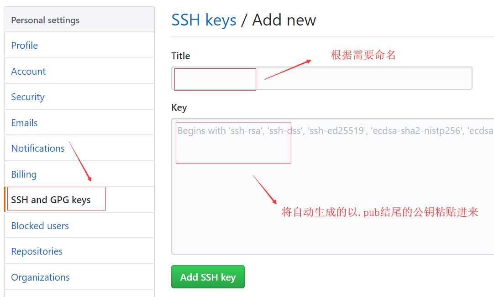

# 背景
当有多个git账号时，比如：
+ 一个gitee，用于公司内部的工作开发；
+ 两个github，用于自己进行一些开发活动；

***
# 步骤
## 生成公钥和私钥对
1.生成一个公司用的SSH-Key
`$ ssh-keygen -t rsa -C 'xxxxx@company.com' -f ~/.ssh/gitee_id_rsa`
2.生成一个github用的SSH-Key
`$ ssh-keygen -t rsa -C 'xxxxxone@qq.com' -f ~/.ssh/github_id_rsaone`
3.生成另外一个github用的SSH-Key
`$ ssh-keygen -t rsa -C 'xxxxxtwo@qq.com' -f ~/.ssh/github_id_rsatwo`
命令运行完之后会在~/.ssh 目录下生成3对公钥和私钥。公钥末尾的值自动跟上面输入的邮箱对应。

    gitee_id_rsa gitee_id_rsa.pub
    github_id_rsaone github_id_rsaone.pub
    github_id_rsatwo github_id_rsatwo.pub

***
## 配置config文件
在 ~/.ssh 目录下新建一个config文件，~对应windows下的用户目录，添加以下内容。
其中HostName为git服务器的域名，Host为下载代码时需要替换的域名。IdentityFile指定私钥的路径，私钥名称跟上面保持一致。

    # gitee
    Host gitee.com
    HostName gitee.com
    PreferredAuthentications publickey
    IdentityFile ~/.ssh/gitee_id_rsa
    # github
    Host github.com.one
    HostName github.com
    PreferredAuthentications publickey
    IdentityFile ~/.ssh/github_id_rsaone
    # github
    Host github.com.two
    HostName github.com
    PreferredAuthentications publickey
    IdentityFile ~/.ssh/github_id_rsatwo

***
## 配置公钥到git,分别对应3个不同的账户
登录[github](https://github.com/ "github的网址")，配置公钥

***
# 用ssh命令分别测试

    $ ssh -T git@gitee.com
    $ ssh -T git@github.com.one
    $ ssh -T git@github.com.two
这里以github为例，成功的话会返回下面内容

    Hi javahikers! You've successfully authenticated, but GitHub does not provide shell access.

***
# 下载代码注意事项
1.路径以http://开头，可以下载。提交代码时,会提示没有权限。[代码地址](https://github.com/javahikers/algorithms-studying)

    git clone https://github.com/javahikers/algorithms-studying.git

2.路径以git@ 开头，下载代码时会进行权限校验。只有登录[github](https://github.com/ "github的网址")之后才能切换成git开头的路径。如果自己开发，推荐使用这种方式。
将github.com替换成config文件中配置的Host。[代码地址](https://github.com/javahikers/algorithms-studying)

    git clone git@github.com.two:javahikers/algorithms-studying.git

3.不变更路径会提示没有权限下载

    $ git clone git@github.com:javahikers/algorithms-studying.git
    Cloning into 'algorithms-studying'...
    git@github.com: Permission denied (publickey).
    fatal: Could not read from remote repository.
    Please make sure you have the correct access rights
    and the repository exists.

***
