通过IDEA创建多模块项目，有时候需要树形结构，有的需要平行结构，下面将手把手教你如何创建多模块项目。
### 新建项目
#### 打开IDEA新建项目

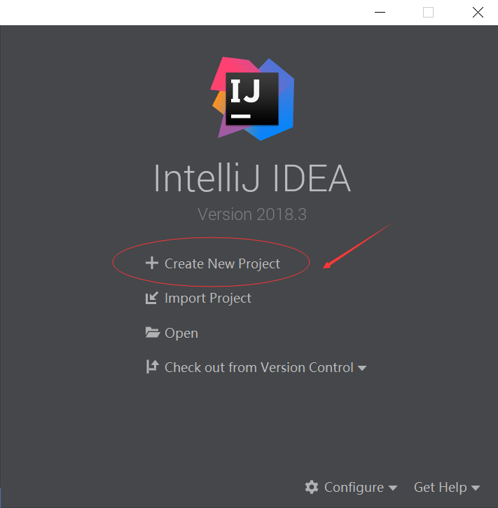

---
#### 用maven创建项目，点击next 进入下一步

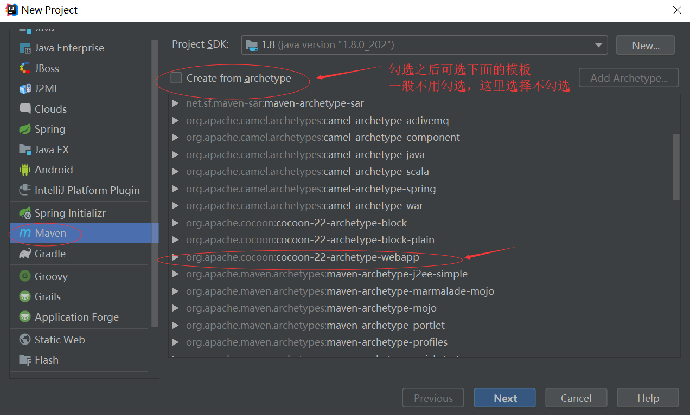

---
#### 建立groupId,artifactId,version信息

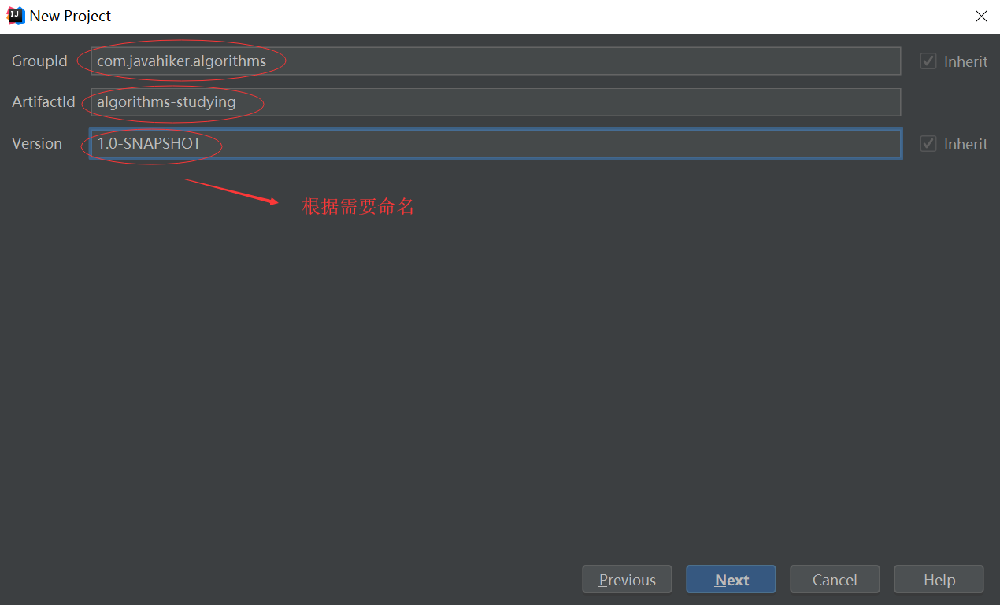

---
#### 建项目名与项目位置

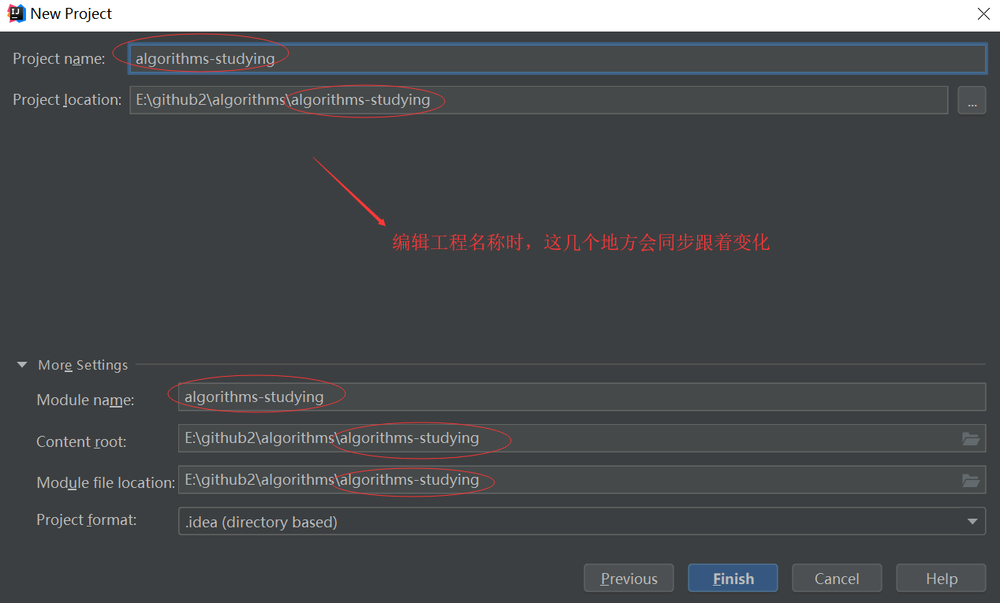

---
#### 建好的项目目录如下，红框内的文件可以删除或是保留

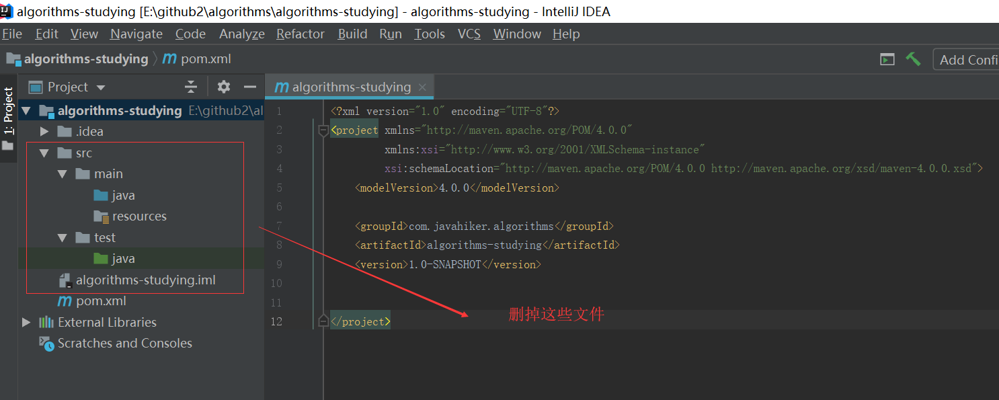

---
#### 删除多余的文件

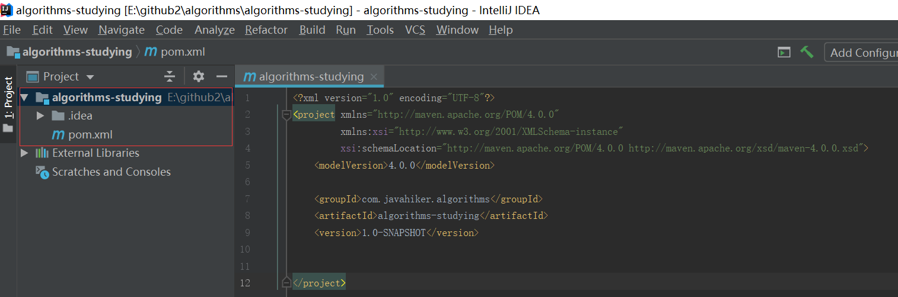

---
### 创建子模块，父子模块之间是树形结构
#### 新建模块

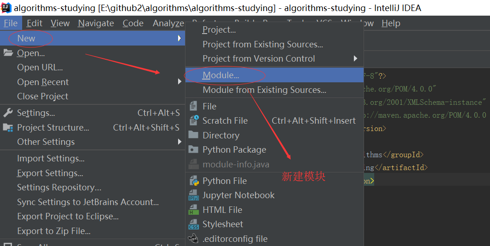

---
#### 选择Maven,点Next

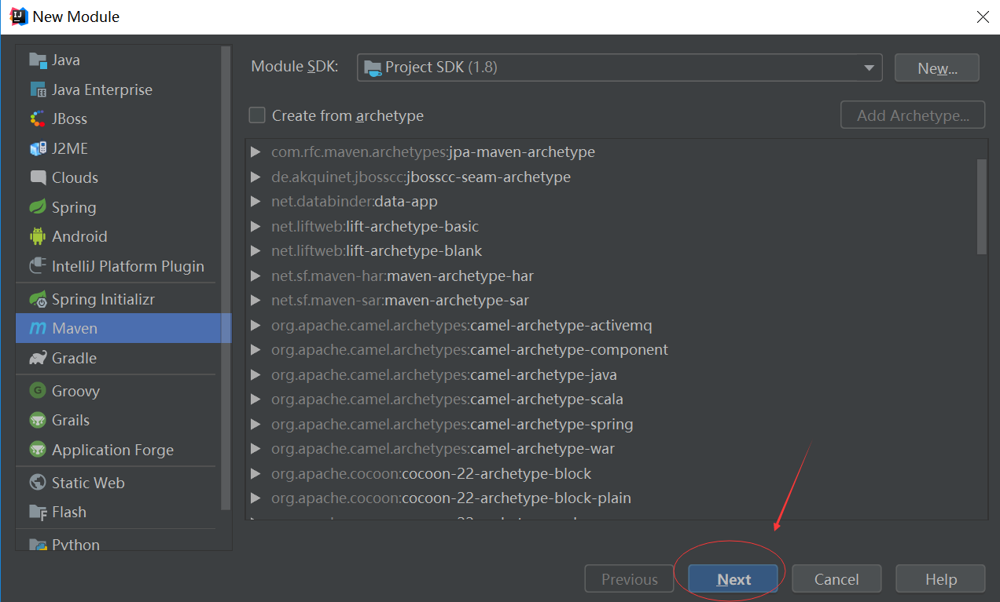

---
#### 选择父模块

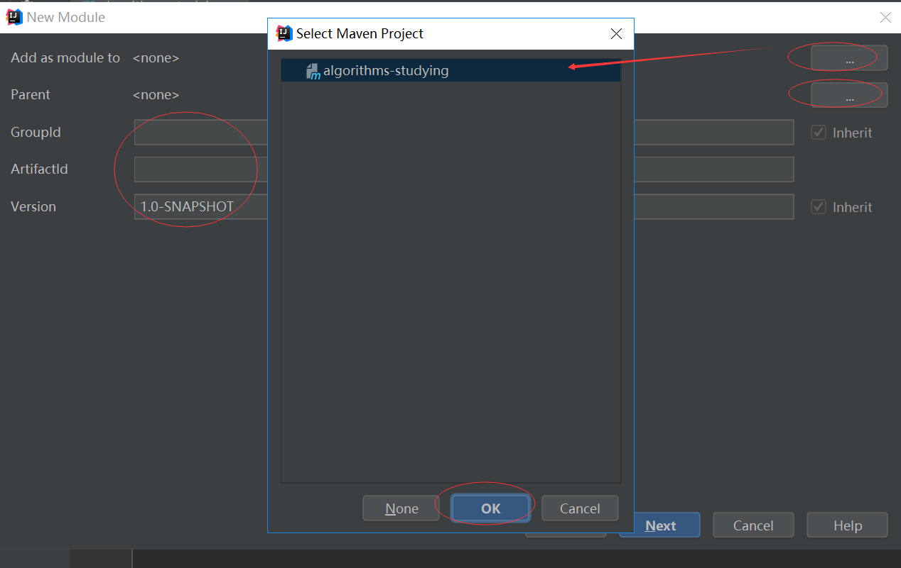

---
#### ArtifactId对应模块名称

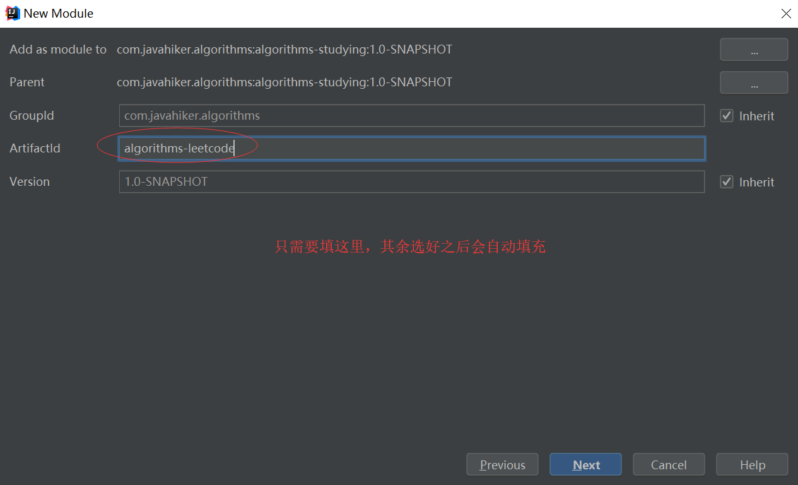

---
#### 填写子模块名称

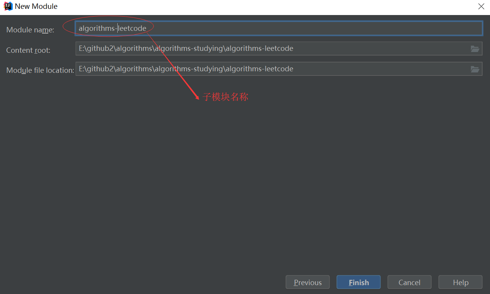

---
#### 生成树形结构的父子模块

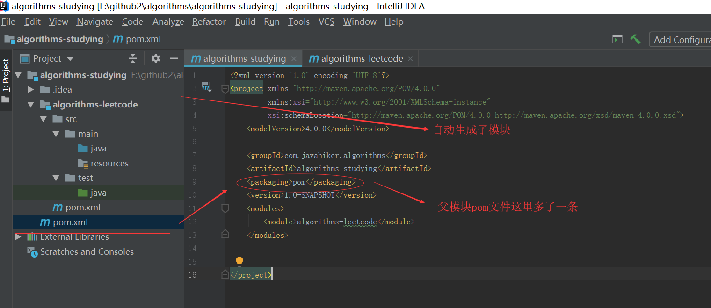

---
### 创建子模块，父子模块之间是平行结构
#### 重复之前创建子模块的步骤，直到填写子模块名称 这一步，让子模块跟跟父模块处于平行的目录

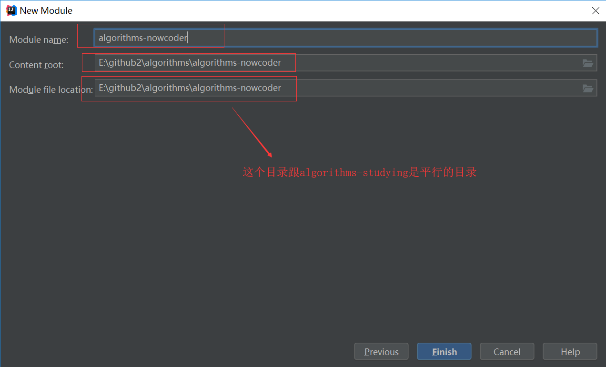

---
#### 生成平行结构的父子模块

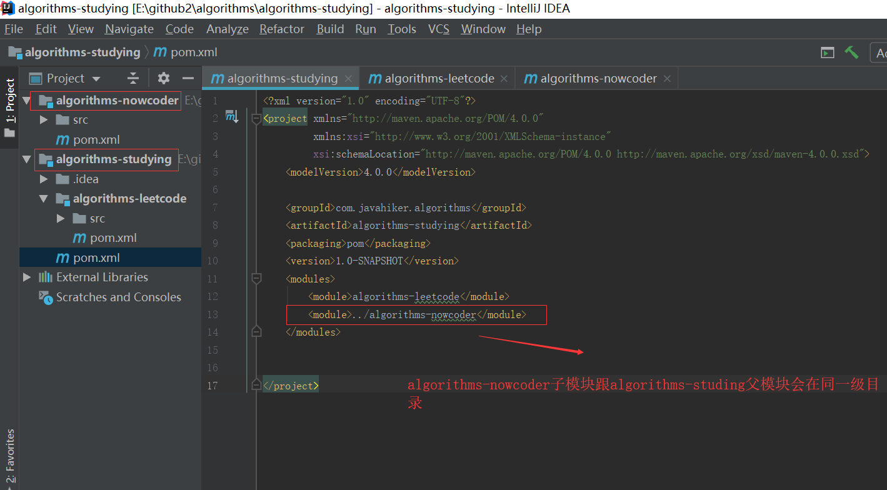

***
### IDEA删除模块，然后再创建时出现异常
删除模块，然后再创建相同名称的模块时，往往会提示：

        Maven:Failed to create a Maven project ‘…pom.xml’ already exists in VFS

* 模块都已经删除了，怎么还提示我有相同的工程呢？

* 原因，原先的那个Project其实还是在我们的电脑上，即VFS虚拟档案系统。

* 解决办法

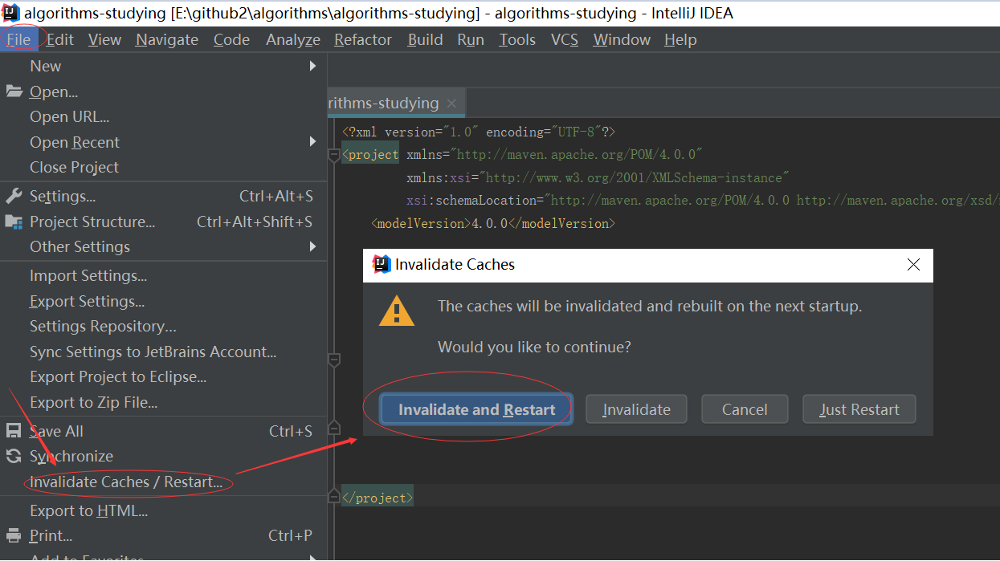

***