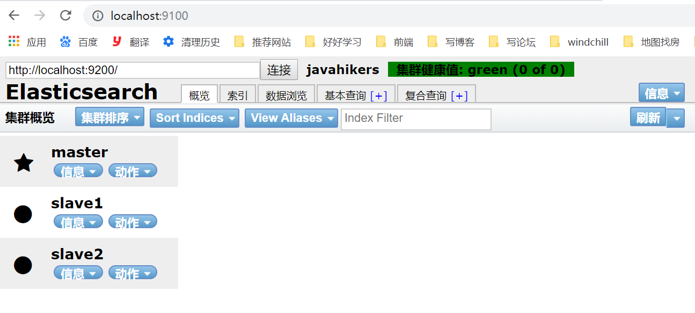

本文以windows环境为例，介绍Elasticsearch的安装使用，linux环境请下载tar包，并在linux环境通过命令行解压
# elasticsearch单实例和相关插件的安装
## elasticsearch下载安装
去[官网](https://www.elastic.co/cn/downloads/past-releases/elasticsearch-5-6-9)下载安装版本5.6.9，跟着[官网教程](https://www.elastic.co/cn/downloads/elasticsearch)将工程跑起来
1. 解压之后，启动bin目录下的脚本elasticsearch.bat
2. 页面访问`http://localhost:9200`

---
## 插件elasticsearch-head下载安装
下载[elasticsearch-head](https://github.com/mobz/elasticsearch-head),用于监控es集群的健康状态。启动并访问工程：

	git clone git://github.com/mobz/elasticsearch-head.git
	cd elasticsearch-head
	npm install
	npm run start

访问`http://localhost:9100/`

---
## 解决elasticsearch-head和elasticsearch的跨域问题
在elasticsearch-5.6.9/config/elasticsearch.yml文件末尾添加以下配置，设置允许跨域访问。并重启elasticsearch

	http.cors.enabled: true
	http.cors.allow-origin: "*"

对跨域的理解：

	以ajax请求为例，前端服务有对应的ip和端口，它只能往这个ip和端口请求数据，
	往其他ip和端口（也可理解为不同的进程）发送请求一律是跨域。后端发送请求时
	不存在跨域问题，设想：前端服务可以往自己的后台发送请求，通过它自己的后台
	再向别人发送请求，就不存在跨域问题了。

---
## kibana下载安装
kibana是一个配合Elasticsearch工作的分析和可视化平台，一些和 Elasticsearch 通过 RESTFul API 交互的请求可以在这里面比较方便的输入和回显。
去官网下载安装[版本5.6.9](https://www.elastic.co/cn/downloads/past-releases/kibana-5-6-9)，跟着[官网教程](https://www.elastic.co/cn/downloads/kibana)将工程跑起来
1. 解压之后，启动bin目录下的脚本kibana.bat
2. 页面访问`http://localhost:5601`

---
# elasticsearch分布式安装
## 拷贝两份相同的文件，作为两个备机使用

---
## 配置config/elasticsearch.yml文件
主配置：

	http.cors.enabled: true
	http.cors.allow-origin: "*"
	cluster.name: javahikers
	node.name: master
	node.master: true
	network.host: 127.0.0.1

slave1配置

	cluster.name: javahikers
	node.name: slave1
	node.master: false
	network.host: 127.0.0.1
	http.port: 9201
	discovery.zen.ping.unicast.hosts: ["127.0.0.1"]

slave2配置

	cluster.name: javahikers
	node.name: slave2
	node.master: false
	network.host: 127.0.0.1
	http.port: 9202
	discovery.zen.ping.unicast.hosts: ["127.0.0.1"]

配置说明：cluster.name集群名称。node.name节点名称。node.master为true表示自己有机会成为主节点，不配置时默认为true。network.host绑定ip，如果不配置默认绑定127.0.0.1。http.port绑定端口,如果不配置默认绑定9200。discovery.zen.minimum_master_nodes防止脑裂配置项，表示至少需要几个节点才能组成集群。
slave1和slave2指定的端口和默认端口不要冲突,启动bin目录下的脚本elasticsearch.bat，先启动master，再启动slave1和slave2，访问`http://localhost:9100/`
每次手工启动上面3个es服务会显得很笨拙，可以将它们安装为windows服务，安装过程也很简单，请参考我的另一篇博文，[《Elasticsearch5.6.9-elasticsearch集群安装为windows服务》](https://javahikers.github.io/2019/07/14/elasticsearch-cluster-installed-for-windows-services/)

设想1：集群扩容非常的容易,可以再添加slave3,slave4...
设想2：如果将slave1和slave2也加上这段配置

	http.cors.enabled: true
	http.cors.allow-origin: "*"

则通过elasticsearch-head连接任意一个地址`http://localhost:9200/,http://localhost:9201/,http://localhost:9202/`都能连上整个集群

---
## 对elasticsearch.yml配置文件的说明

cluster.name:集群名称，节点和节点之间要想进同一个集群，需要设置相同的集群名称。
node.name:节点名称。
node.master: 是否有成为主节点的资格，默认为true
node.data: 节点是否存储数据，默认为true
path.data，path.logs:可手动配置路径。防止升级 Elasticsearch 时日志被删除。
bootstrap.memory_lock:JVM 不被交换到硬盘，将bootstrap.memory_lock设置成true可保证节点健康
network.host:不设置会默认绑定回环地址127.0.0.1。
http.port:不设置会会默认绑定9200端口，集群部署时应避免端口冲突。
discovery.zen.ping.unicast.hosts:跟其他节点组成集群时，需要配置该项。
discovery.zen.minimum_master_nodes:不设置的话可能出现脑裂问题，造成数据丢失。为了避免这样，该项设置为(master_eligible_nodes / 2) + 1，3台机器应该设置成2。

对于脑裂的解释：

	discovery.zen.minimum_master_nodes：该属性定义，为了形成一个集群，有主节点资格并互相连接的节点的最小数目。
	例子：
	一个有10节点的集群，且每个节点都有成为主节点的资格，discovery.zen.minimum_master_nodes参数设置为6。
	正常情况下，10个节点，互相连接，大于等于6，就可以形成一个集群。
	若某个时刻，其中有3个节点断开连接。剩下7个节点，大于6，继续运行之前的集群。而断开的3个节点，小于6，不能形成一个集群。
	该参数就是为了防止”脑裂”的产生。“脑裂”可以防止一个集群变成多个集群。

生产环境node.master和node.data的配置可以参考这篇文章，[《elasticsearch节点(角色)类型解释：node.master和node.data》](https://blog.csdn.net/J_bean/article/details/80147277)

