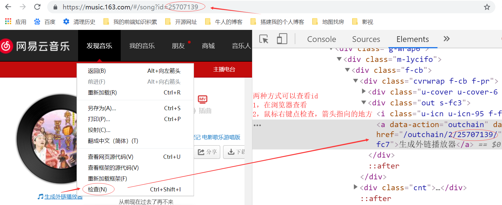

喜欢下面的歌吗，可以点我哦，下面会教大家怎么使用

* 我喜欢的歌曲，不定期更新


* 我的个人歌单，不定期更新


* 抖音排行榜，每周三更新


* 经典粤语合集


***
# 步骤
## 安装hexo-tag-aplayer插件
    $ npm install hexo-tag-aplayer --save

## 在Hexo配置文件_config.yml中设置
    aplayer:
      meting: true
接着就可以在文章中使用MetingJS播放器了

## 在文章中引入模板
1.歌曲模板

    

2.歌单模板

    

***
# 关于模板的选项列表
[MetingJS](https://github.com/metowolf/MetingJS "MetingJS的github")是基于[Meting API](https://github.com/metowolf/Meting "Meting的github")的 APlayer 衍生播放器，引入3.0以上的MetingJS 后，播放器将支持对于QQ音乐、网易云音乐、虾米、酷狗、百度等平台的音乐播放
模板的选项列表如下:


  <table> 
   <thead> 
    <tr> 
     <th>选项</th> 
     <th>默认值</th> 
     <th>描述</th> 
    </tr> 
   </thead> 
   <tbody> 
    <tr> 
     <td>id</td> 
     <td><strong>必须值</strong></td> 
     <td>歌曲 id / 播放列表 id / 相册 id / 搜索关键字</td> 
    </tr> 
    <tr> 
     <td>server</td> 
     <td><strong>必须值</strong></td> 
     <td>音乐平台: <code>netease</code>, <code>tencent</code>, <code>kugou</code>, <code>xiami</code>, <code>baidu</code></td> 
    </tr> 
    <tr> 
     <td>type</td> 
     <td><strong>必须值</strong></td> 
     <td><code>song</code>, <code>playlist</code>, <code>album</code>, <code>search</code>, <code>artist</code></td> 
    </tr> 
    <tr> 
     <td>fixed</td> 
     <td><code>false</code></td> 
     <td>开启固定模式</td> 
    </tr> 
    <tr> 
     <td>mini</td> 
     <td><code>false</code></td> 
     <td>开启迷你模式</td> 
    </tr> 
    <tr> 
     <td>loop</td> 
     <td><code>all</code></td> 
     <td>列表循环模式：<code>all</code>, <code>one</code>,<code>none</code></td> 
    </tr> 
    <tr> 
     <td>order</td> 
     <td><code>list</code></td> 
     <td>列表播放模式： <code>list</code>, <code>random</code></td> 
    </tr> 
    <tr> 
     <td>volume</td> 
     <td>0.7</td> 
     <td>播放器音量</td> 
    </tr> 
    <tr> 
     <td>lrctype</td> 
     <td>0</td> 
     <td>歌词格式类型</td> 
    </tr> 
    <tr> 
     <td>listfolded</td> 
     <td><code>false</code></td> 
     <td>指定音乐播放列表是否折叠</td> 
    </tr> 
    <tr> 
     <td>storagename</td> 
     <td><code>metingjs</code></td> 
     <td>LocalStorage 中存储播放器设定的键名</td> 
    </tr> 
    <tr> 
     <td>autoplay</td> 
     <td><code>true</code></td> 
     <td>自动播放，移动端浏览器暂时不支持此功能</td> 
    </tr> 
    <tr> 
     <td>mutex</td> 
     <td><code>true</code></td> 
     <td>该选项开启时，如果同页面有其他 aplayer 播放，该播放器会暂停</td> 
    </tr> 
    <tr> 
     <td>listmaxheight</td> 
     <td><code>340px</code></td> 
     <td>播放列表的最大长度</td> 
    </tr> 
    <tr> 
     <td>preload</td> 
     <td><code>auto</code></td> 
     <td>音乐文件预载入模式，可选项： <code>none</code>, <code>metadata</code>, <code>auto</code></td> 
    </tr> 
    <tr> 
     <td>theme</td> 
     <td><code>#ad7a86</code></td> 
     <td>播放器风格色彩设置</td> 
    </tr> 
   </tbody> 
  </table>


***
# 关于歌曲id  播放列表id 如何获取
登录[网易云音乐](https://music.163.com/ "点我进入网易云音乐官网")，搜索《一生所爱》，点击生成外链播放器。这时候会提示：由于版权保护，无法生成外链。不要着急，通过如下方式找到id

