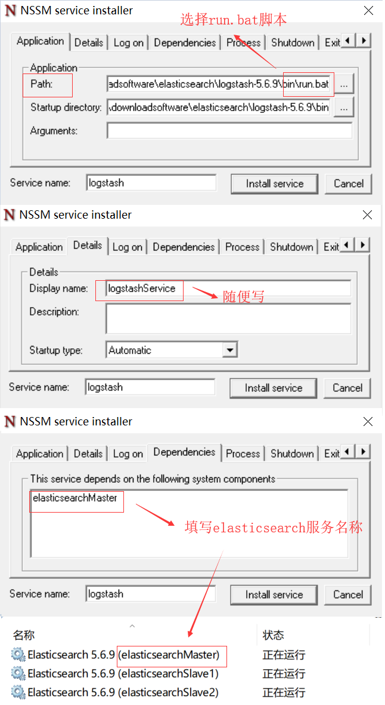

在安装logstash之前，请确认已安装好jdk1.8，并配置好环境变量。
安装之前还需阅读[《Elasticsearch5.6.9-elasticsearch集群安装为windows服务》](https://javahikers.github.io/2019/07/14/elasticsearch-cluster-installed-for-windows-services/),并按照步骤安装好elasticsearch的服务。

# 下载版本
去官网下载[Logstash 5.6.9](https://www.elastic.co/cn/downloads/past-releases/logstash-5-6-9)

# 安装logstash 为windows服务
## 创建文件 logstash.conf 
在logstash-5.6.9\bin目录下创建配置文件logstash.conf,内容如下

    input {
      tcp {
        port => 5544
      }
    }
     
    output {
      elasticsearch {
        hosts => ["localhost:9200"]
      }
    }

## 创建运行脚本 run.bat
在logstash-5.6.9\bin目录下创建脚本 run.bat,内容如下

    logstash.bat agent -f logstash.conf

## 下载nssm，拷贝nssm.exe文件
点击[进入nssm官网](https://nssm.cc/download)，下载nssm 2.24版本
解压拷贝nssm-2.24\win64目录下的nssm.exe到logstash-5.6.9\bin目录

## 安装logstash
在logstash-5.6.9\bin目录运行

    nssm install logstash

在弹出的界面Path选择run.bat,Details选项卡设置显示名，Dependencies选项卡设置依赖服务 elasticsearchMaster

最后点击install service 安装成功

