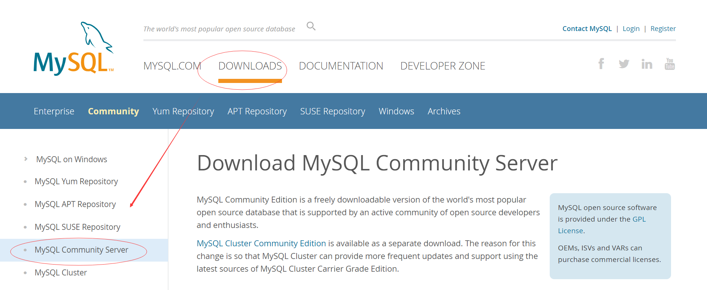
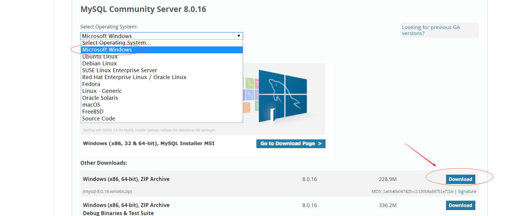
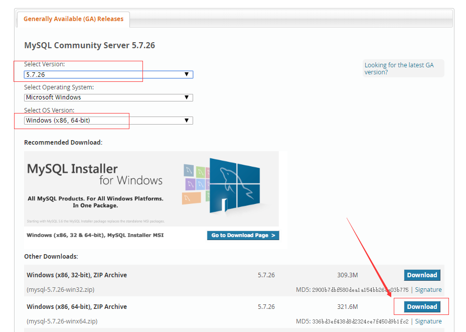
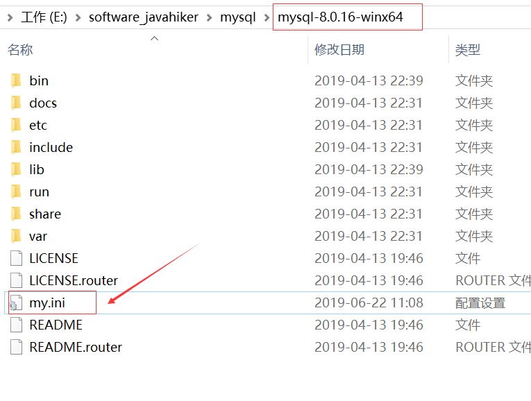
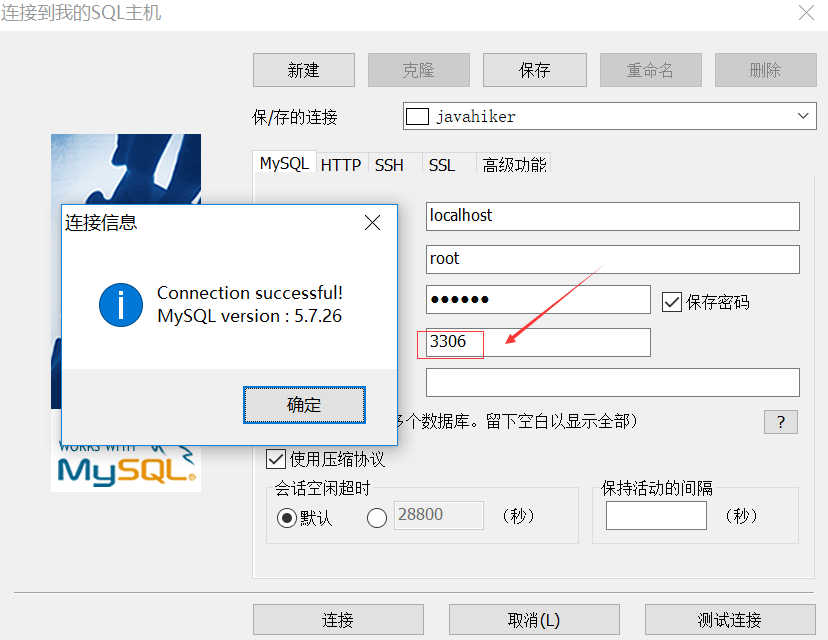
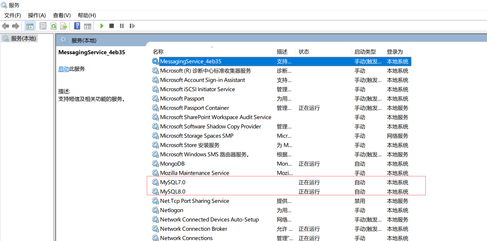
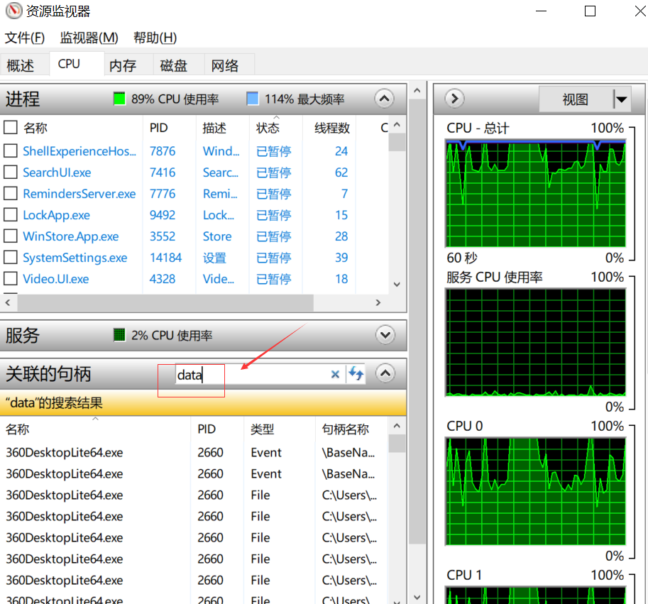

# 下载版本
## 官网下载两个不同的版本
进入[mysql官网](https://dev.mysql.com/downloads/mysql/)，页面导航 DOWNLOADS=>Mysql Community Server

+ 下载最新版本，目前是8.0.16，根据自己电脑配置选择64位或是32位

+ 下载5.7.26版本

官网下载速度非常的快哦，大概只要1到2分钟的样子。

***
## 百度网盘下载两个不同的版本
如果官网进不去，可以去我分享的百度网盘 [mysql官方文件](https://pan.baidu.com/s/14SQoI81uRBzrlMvwN0RT9w) 下载，提取码：b0po

***
# 安装过程
## 安装mysql前的准备工作
### 在文件夹的根目录添加配置文件
我的压缩包解压之后目录

    E:\software_javahiker\mysql\mysql-5.7.26-winx64
    E:\software_javahiker\mysql\mysql-8.0.16-winx64

在根目录（mysql-5.7.26-winx64目录和mysql-8.0.16-winx64目录）下新建文件my.ini

my.ini内容如下，文件保存为ANSI格式，否则后面会报错

    [client]
    # 设置mysql客户端连接服务端时默认使用的端口
    port=3306
    default-character-set=utf8
    [mysqld]
    #设置3306端口
    port=3306
    # 设置mysql的安装目录
    basedir =E:/software_javahiker/mysql/mysql-5.7.26-winx64
    # 设置mysql数据库的数据的存放目录
    datadir =E:/software_javahiker/mysql/mysql-5.7.26-winx64/data
    tmpdir =E:/software_javahiker/mysql/mysql-5.7.26-winx64/data
    socket=E:/software_javahiker/mysql/mysql-5.7.26-winx64/data/mysql.sock
    log-error=E:/software_javahiker/mysql/mysql-5.7.26-winx64/data/mysql_error.log
    # 设置mysql服务端默认字符集
    character-set-server=utf8mb4
    # 创建新表时将使用的默认存储引擎
    default-storage-engine=INNODB
    # 允许最大连接数
    max_connections=200
    # 允许连接失败的次数。
    max_connect_errors=10
    # 默认使用“mysql_native_password”插件认证
    #mysql_native_password
    default_authentication_plugin=mysql_native_password
    [mysql]
    # 设置mysql客户端默认字符集
    default-character-set=utf8mb4

+ 上述涉及到路径的配置，需要改成你自己解压之后的路径，可以看出有5个地方需要修改
+ 5.7.26版本的my.ini端口配置port=3306。8.0.16版本的my.ini端口配置port=3307，这样在后面启动服务的时候可以避免端口占用的问题。
+ 补充：可通过以下命令查看windows的端口被哪些程序占用。

    C:\Users\javahiker>netstat -ano | findstr 3306
      TCP    0.0.0.0:3306           0.0.0.0:0              LISTENING       3752
    C:\Users\javahiker>tasklist | findstr 3752
    mysqld.exe                    3752 Services                   0      4,628 K
    C:\Users\javahiker>taskkill -f -pid 3752
    错误: 无法终止 PID 为 3752 的进程。
    原因: 拒绝访问。
    C:\WINDOWS\system32>taskkill -f -pid 3752
    成功: 已终止 PID 为 3752 的进程。

解释：
netstat命令查看程序端口为3306的进程号（PID）为3752
tasklist命令查看程序mysql.exe的进程号为3752
taskkill命令将进程号为3752的程序杀死
第一次没能杀死进程，因为是普通用户。第二次"以管理员身份运行"cmd，能成功杀死进程
进程被杀之后可以在"服务"里重新启动程序。如果设置了程序启动类型为"自动"，下次电脑重启时，程序会自动启动。

### 配置环境变量
如果要同时配置两个版本的mysql，这一部分请直接跳过。
+ 右键点击我的电脑->属性->高级系统设置->环境变量->系统变量->新建

    变量名MYSQL_HOME01，路径是E:\software_javahiker\mysql\mysql-5.7.26-winx64
    变量名MYSQL_HOME02，路径是E:\software_javahiker\mysql\mysql-8.0.16-winx64

+ 在系统变量下找到Path，点击编辑->新建填写

    %MYSQL_HOME01%\bin

+ 注意Path里只添加一种配置。此时通过命令行直接运行的mysql程序，版本将是5.7.26。如果想使用8.0.16的mysql，则将系统变量Path下的 %MYSQL_HOME01%\bin 修改为 %MYSQL_HOME02%\bin
+ 配置好环境变量之后，不管是在mysql-5.7.26-winx64的bin目录，还是在mysql-8.0.16-winx64的bin下运行mysql命令，都将运行环境变量的路径对应的mysql程序。所以如果想同时配置两个版本的mysql，这里请不要配置环境变量，直接跳过。

### 配置localhost
找到C:\Windows\System32\drivers\etc下的hosts文件在尾部添加

    127.0.0.1 localhost
如果已经配置，请忽略

***
## 安装mysql
### 初始化data目录 
初始化命令`mysqld --initialize --user=mysql --console `

    E:\software_javahiker\mysql\mysql-5.7.26-winx64\bin>mysqld --initialize --user=mysql --console
    2019-06-22T13:21:49.131527Z 0 [Warning] TIMESTAMP with implicit DEFAULT value is deprecated. Please use --explicit_defaults_for_timestamp server option (see documentation for more details).
    2019-06-22T13:21:51.594843Z 0 [Warning] InnoDB: New log files created, LSN=45790
    2019-06-22T13:21:52.279174Z 0 [Warning] InnoDB: Creating foreign key constraint system tables.
    2019-06-22T13:21:52.568183Z 0 [Warning] No existing UUID has been found, so we assume that this is the first time that this server has been started. Generating a new UUID: b2e13289-94f0-11e9-9e26-18dbf25874a3.
    2019-06-22T13:21:52.591620Z 0 [Warning] Gtid table is not ready to be used. Table 'mysql.gtid_executed' cannot be opened.
    2019-06-22T13:21:52.605971Z 1 [Note] A temporary password is generated for root@localhost: wngo(g6heVK.

记住root用户的临时密码 wngo(g6heVK.

### 安装mysql服务 
安装命令`mysqld --install 服务名称`，卸载命令`mysqld --remove 服务名称`
+ 在cmd上右键->以管理员身份运行
+ 如果前面已经配置好环境变量，下面安装另外一个服务时，修改一下环境变量。如果没有配置环境变量，这里进入到目录之后可以直接运行。所以前面有建议大家不要配置环境变量。
+ 安装mysql服务
    

    E:\software_javahiker\mysql\mysql-5.7.26-winx64\bin>mysqld --install MySQL7.0
    Service successfully installed.

### 启动服务
启动命令`net start 服务名称`，停止命令`net stop 服务名称` 

    E:\software_javahiker\mysql\mysql-5.7.26-winx64\bin>net start mysql7.0
    MySQL7.0 服务正在启动 .
    MySQL7.0 服务已经启动成功。

### 修改root用户初始密码
临时密码用前面保存的密码
+ 输入登陆命令`mysql -uroot -p`，密码填写之前保存的临时密码

    E:\software_javahiker\mysql\mysql-5.7.26-winx64\bin>mysql -uroot -p
    Enter password: ************
    Welcome to the MySQL monitor.  Commands end with ; or \g.
    Your MySQL connection id is 2
    Server version: 5.7.26

+ 修改root密码，`ALTER user 'root'@'localhost' IDENTIFIED BY '123456';`

    mysql> ALTER user 'root'@'localhost' IDENTIFIED BY '123456';
    Query OK, 0 rows affected (0.00 sec)

注意：网上很多人说输入命令`mysqladmin -uroot -p临时密码 password 新密码` 来修改密码，对于版本8.0.16的mysql来说这种方式不支持

对于8.0.16版本的mysql，重复上面 [安装mysql](#安装mysql) 的过程即可

***
## 验证是否装好
### 数据库连接工具进行连接验证
本人习惯用SQLyog, 进入[官网](https://sqlyog.en.softonic.com/) 下载

端口改成3307，同样可以连接上

最后来看看"服务"是不是都正常运行

***
# 同时安装两个MySQL注意事项
安装中途出现错误时，要会google和百度，一般是要修改my.ini配置文件
实在搞不定的话3步回到原点，重新填坑
1. 停掉服务 `net stop 服务名`
2. 移除服务 `mysqld --remove 服务名`
3. 删除根目录下的data文件夹。

data文件夹可能被其他进程占用导致删除不了。删除的正确姿势是：任务管理器->性能->打开资源监视器->关联的句柄处填写data，将下面的进程全部干掉即可删除data文件夹

这时候，修改my.inf，又可以开开心心地重复 [安装mysql](#安装mysql) 的过程了，直到搞定问题，相信你哦，加油！祝你好运！
