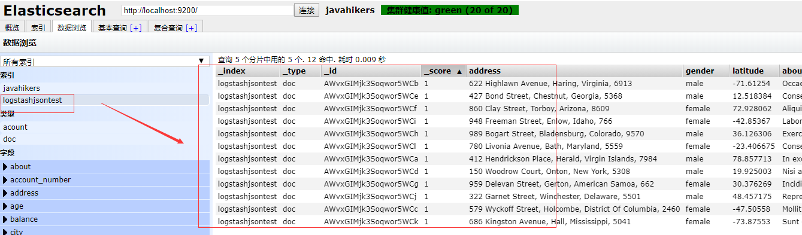

# 环境准备
1. Elasticsearch和Logstash版本：5.6.9
2. Elasticsearch单机或集群,参考[《Elasticsearch5.6.9-elasticsearch集群安装为windows服务》](https://javahikers.github.io/2019/07/14/elasticsearch-cluster-installed-for-windows-services/)
3. Logstash客户端，参考[《Elasticsearch5.6.9-windows下安装logstash》](https://javahikers.github.io/2019/07/14/install-logstash-on-windows/)
4. json格式的数据，去[json数据生成网站](https://www.json-generator.com)生成的json格式的数据。生成的数据不能直接使用，需要手动加工一下，我已经加工好了，可以点击[下载数据](/download/generated.rar)

        补充：第4点有个坑，json格式的数据末尾需要有回车换行符，否则只能读一条数据。

# 导入数据
1. json.conf配置文件

        #读取json文件
        input{
            file{
                #设置json文件路径
                #指定单一文件，填写绝对路径
                path => "D:\downloadsoftware\elasticsearch\jsonData\generated.json"
                #指定数组文件，填写绝对路径
                #path => ["D:\downloadsoftware\elasticsearch\jsonData\generated1.json","D:\downloadsoftware\elasticsearch\jsonData\generated2.json","D:\downloadsoftware\elasticsearch\jsonData\generated3.json"]
                start_position=>"beginning"
                
                sincedb_path=>"/dev/null"
                
                #设置编码
                codec=>json{
                    charset=>"UTF-8"
                }
            }
        }

        #过滤格式化数据阶段
        filter {
            mutate {
                #删除无效的字段
                remove_field=>["@version","@timestamp","host","path","message"]
            }
        }

        #数据输出到ES阶段
        output{
            #日志输出格式，json_lines;rubydebug等
            stdout{
            codec => rubydebug
            }
            
            elasticsearch {
            #es地址ip端口
            hosts => "127.0.0.1:9200"
            #索引
            index => "logstashjsontest"
            #类型
            document_type => "doc"
            }
        }

2. 脚本文件importGenerated.bat
下面统一填写绝对路径

        D:\downloadsoftware\elasticsearch\logstash-5.6.9\bin\logstash.bat -f D:\downloadsoftware\elasticsearch\jsonData\json.conf

3. json格式的文件generated.json放在json.conf配置文件指定的path目录

运行脚本importGenerated.bat，即可导入数据

