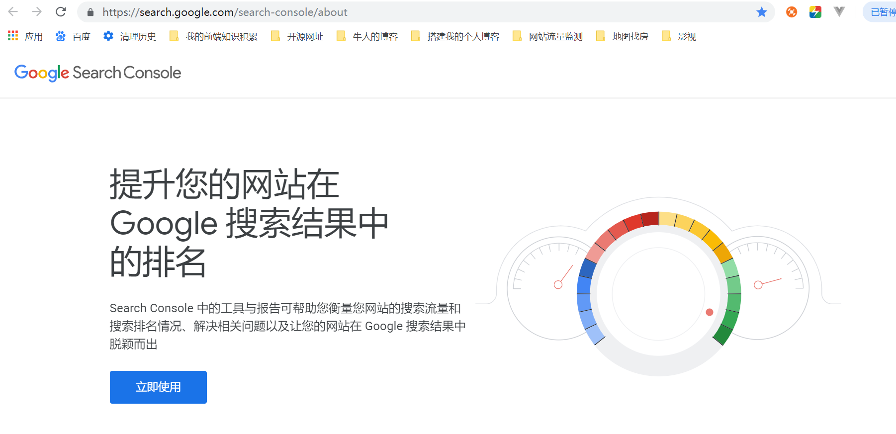
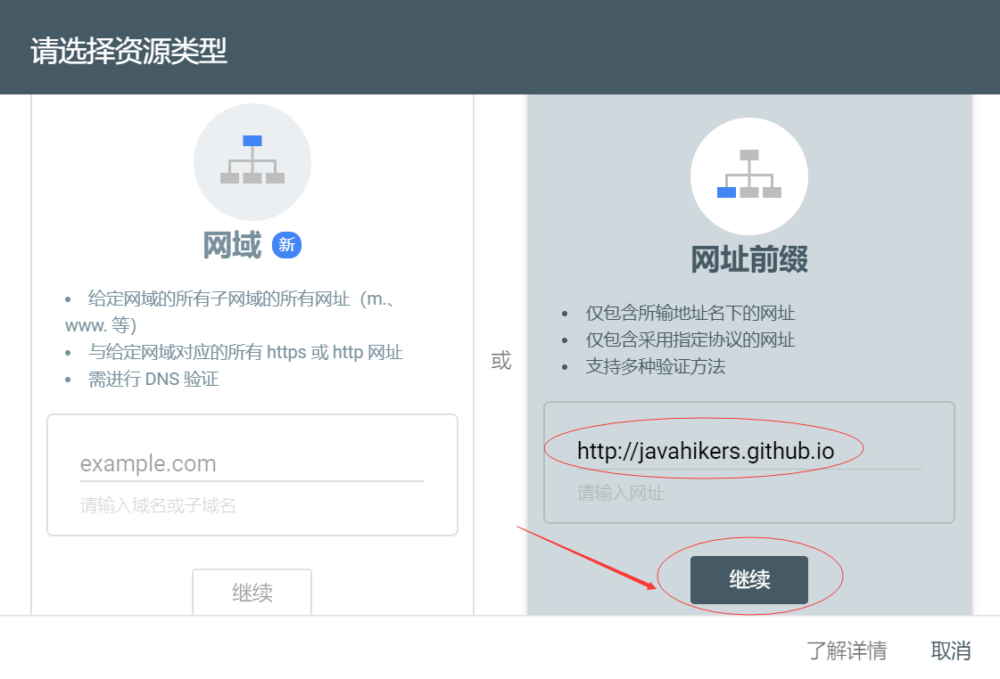
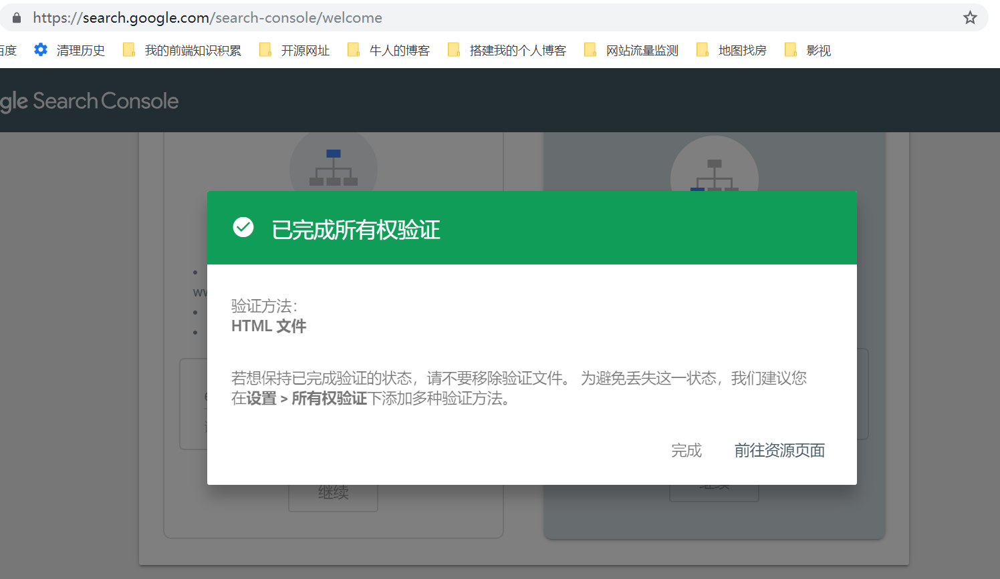
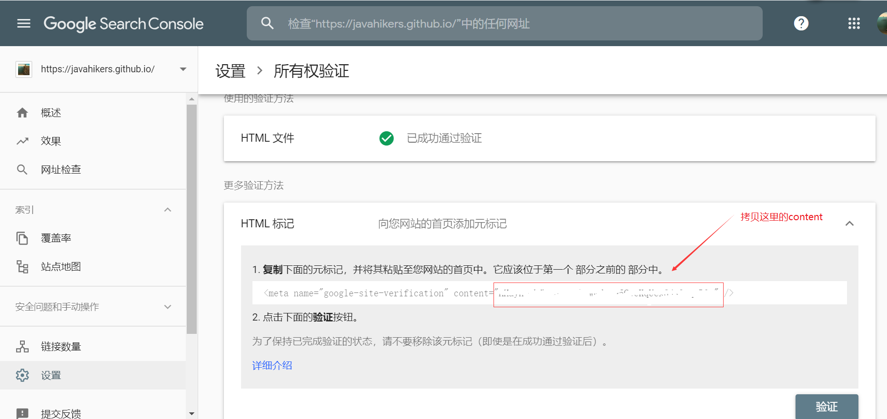
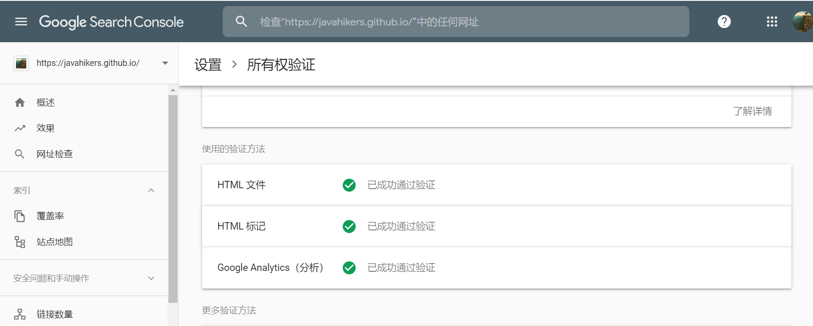
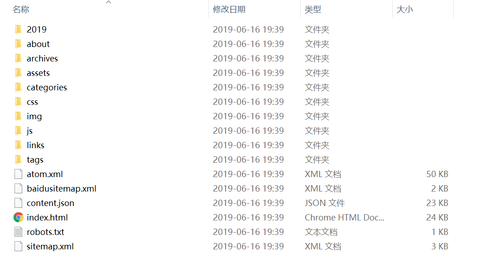
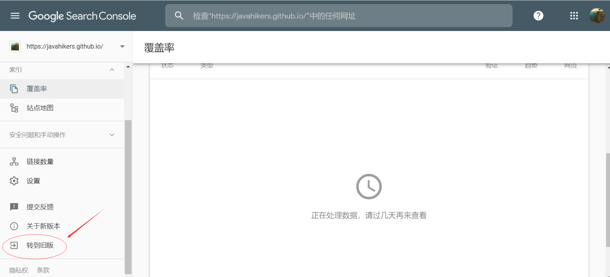
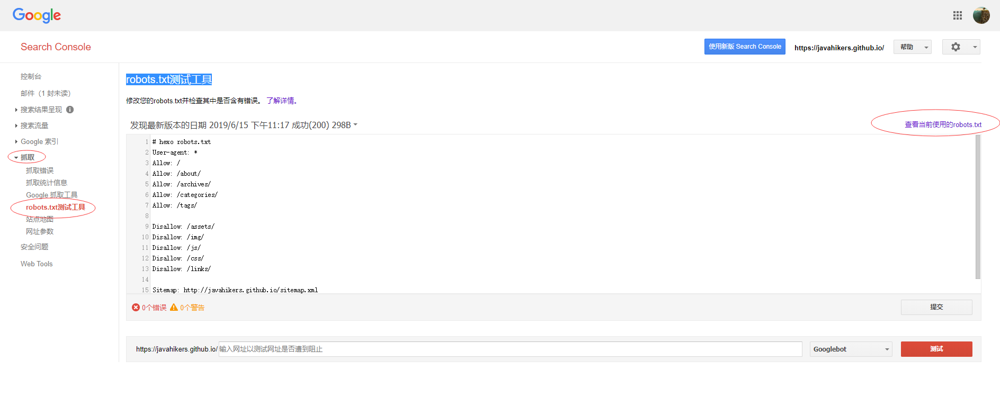
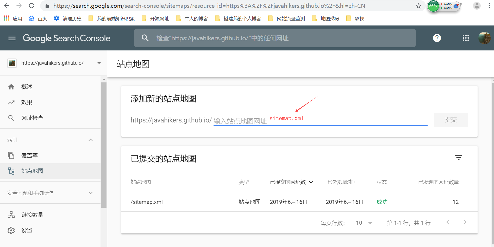
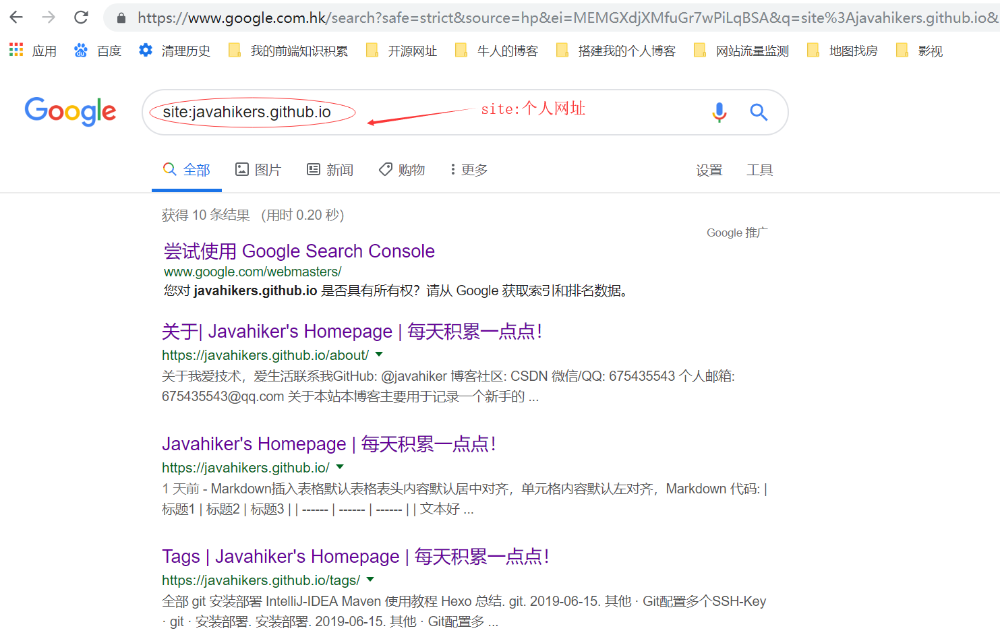

# 登录google账户
进入 [Google Search Console](https://search.google.com/search-console/about "google的SearchConsole")，点击立即使用。

+ 没有google账号，先注册一个google账号
+ 有google账户，输入账户名和密码，登录google账户

***
# 验证网站所有权
添加资源到 [Google Search Console](https://search.google.com/search-console/about "google的SearchConsole") 平台，资源类型选网址前缀，点继续

***
## 验证方式一，通过HTML文件验证
原理：google给你一个html文件，你把它放到你的网站首页的根路径下，证明网站是你的
步骤：
1. 下载google提供的html文件，文件名googlexxxx.html 跟实际下载的文件名保持一致
2. 放到hexo工程目录下的source目录
3. 进入到工程目录，通过以下命令将hexo部署到个人网站

        $ hexo clean 
        $ hexo g
        $ cp source/googlexxxx.html public/
        $ hexo d

说明：
hexo会将source目录下的文件googlexxxx.html打包到public目录。
这个过程中googlexxxx.html的内容被hexo修改了，如果直接部署到我们的网站，google那边会验证不通过。而打包的过程中是不会修改source下的googlexxxx.html文件的，所以可以通过命令行将未被修改的文件googlexxxx.html拷贝过去。这样就能通过google的验证了。

看到这里，恭喜你通过了google的所以权验证了。

***
## 验证方式二，通过HTML标记验证
原理跟上面类似
步骤：
1. 复制标记里面的content的内容
2. 打开hexo->themes->indigo->_config.yml
3. 找到google_site_verification这个配置项，配置content的内容

        google_site_verification: 这里放content的内容

4. 进入到工程目录，通过以下命令将hexo部署到个人网站

        $ hexo clean 
        $ hexo g
        $ hexo d

说明:
我这里用的hexo主题是indigo，分支是card。下载indigo，请访问 [indigo](https://github.com/yscoder/hexo-theme-indigo)
content的内容在下面哦

***

## 验证方式三，通过Google Analytics 验证
原理同上
步骤：
1. 去 [google分析官网](https://analytics.google.com) 注册账户
2. 页面会生成一个"跟踪ID"
2. 打开hexo->themes->indigo->_config.yml
3. 找到google_analytics这个配置项，配置"跟踪ID"的内容

        google_analytics: 这里放"跟踪ID"的内容

4. 进入到工程目录，通过以下命令将hexo部署到个人网站

        $ hexo clean 
        $ hexo g
        $ hexo d

当看到下面这张图时，说明你三种方式都通过验证了，是不是很喜庆的画面。其实用一种方式验证就够了。这样做的目的只是为了证明这个网站确实是你的。

***

## 三种验证方式对比
+ 第1种方式每次部署前需要将googlexxxx.html拷贝到public目录，多了一步操作
+ 第2种和第3种方式配置好，以后就不用动了，推荐使用这两种方式哦

***
# 使用站点地图
## 安装sitemap站点地图自动生成插件
    npm install hexo-generator-sitemap --save
    npm install hexo-generator-baidu-sitemap --save
## 添加站点地图配置到hexo
+ 找hexo根目录下的_config.yml文件
+ 添加以下配置

        # 自动生成sitemap
        sitemap: 
          path: sitemap.xml
        baidusitemap:
          path: baidusitemap.xml

## 配置google的robots.txt测试工具
在hexo工程的source文件夹下新建文件robots.txt，内容如下

    # hexo robots.txt
    User-agent: *
    Allow: /
    Allow: /about/
    Allow: /archives/
    Allow: /categories/
    Allow: /tags/
     
    Disallow: /assets/
    Disallow: /img/
    Disallow: /js/
    Disallow: /css/
    Disallow: /links/
     
    Sitemap: http://javahikers.gitee.io/sitemap.xml
    Sitemap: http://javahikers.gitee.io/baidusitemap.xml

robots.txt文件的内容要根据public下的目录结构填写。Allow表示允许google访问的页面，Disallow表示不允许google访问的页面。可参考我的目录结构和上面的对应关系，根据需要配置

***

## 通过hexo部署文件到个人网站

    $ hexo clean 
    $ hexo g
    $ hexo d

说明:
hexo g命令会在hexo的public目录自动生成站点地图文件sitemap.xml和baidusitemap.xml
同时会将source目录下的文件robots.txt拷贝至public目录。个人网站部署之后，可通过
域名/sitemap.xml，域名/robots.txt的方式验证站点地图文件和访问限控制的配置文件是否上传成功了。

## 使用robots.txt测试工具
前面部署成功之后，才能使用robots.txt测试工具。进入 [Google Search Console](https://search.google.com/search-console/about "google的SearchConsole") 平台，新版本的Search Console平台目前还没有看到robots.txt测试工具这一项，选择切换到旧版，才能找到这一配置项

***

选择 抓取->robots.txt测试工具，在这里可以测试网址是否遭到阻止

***

## 提交站点地图给google
终于等到你了哦，提交站点地图到google，等待google收录吧

***

google收录非常的快哦，site:个人网址  即可验证是否被收录。写到这里已经被google收录啦。开心ing！！！你也来试试吧！

***